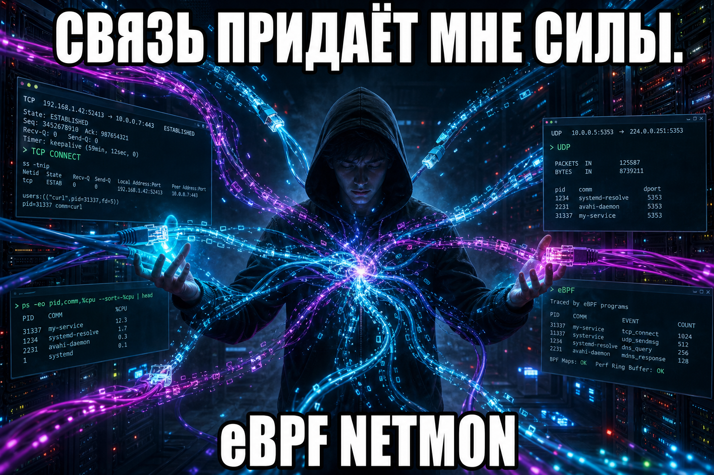

 

---

### привет, я **Invect1ved**

Пишу код там, где пакеты встречаются с процессами: ядро Linux, мобильные клиенты и всё, что живёт между `connect()` и UI.

> **Связь придаёт мне силы.**  
> TCP пришёл с `pid` — и день уже не зря.

- 🔭 сейчас: пассивный мониторинг TCP/UDP на **eBPF**
- 🛠 стек: **C · libbpf · Kotlin · Dart/Flutter · Linux**
- 🎯 люблю низкий уровень, чистый CLI и приложения, которые не врут про сеть

---

### что в репозиториях

| проект | о чём |
| :--- | :--- |
| **[ebpf-netmon](https://github.com/Invect1ved/ebpf-netmon)** | eBPF-агент: TCP/UDP → процесс, без payload, только метаданные |
| **[FACEIT](https://github.com/Invect1ved/FACEIT)** | Kotlin / Android |
| **[StudyFlow](https://github.com/Invect1ved/StudyFlow)** | Flutter / Dart |

---

### статы

 

---

**kernel hooks · ring buffers · mobile UI**

`sudo ./bin/netmon --json`  
и пусть связь придаёт силы дальше.

